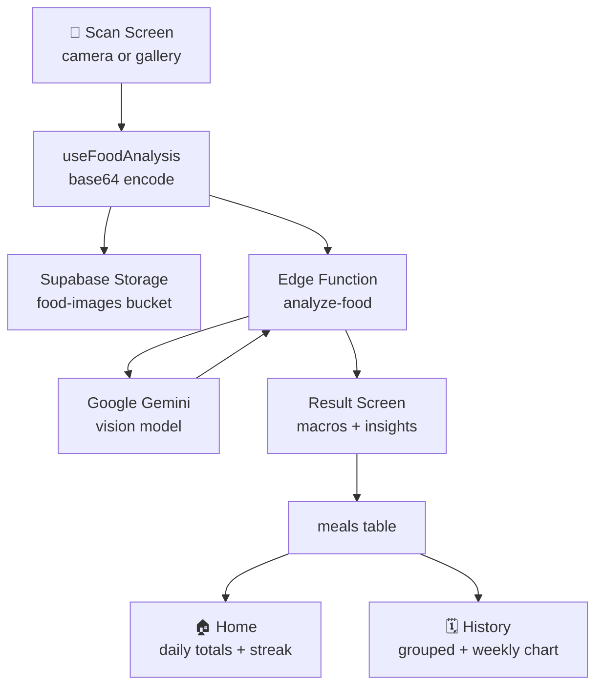

<div align="center">
  

  <h1>🥗 BitelQ</h1>
  <h3>AI-Powered Calorie &amp; Nutrition Tracker</h3>
  <p><em>Snap, Analyze, and Track your daily nutrition effortlessly with Computer Vision &amp; AI.</em></p>

  <p align="center">
    <a href="#-key-features">Key Features</a> •
    <a href="#-architecture--app-flow">App Flow</a> •
    <a href="#-tech-stack">Tech Stack</a> •
    <a href="#-getting-started">Getting Started</a> •
    <a href="#-database--backend-schema">Database Schema</a> •
    <a href="#-author">Author</a>
  </p>

  <p align="center">
    
    
    
    
    
  </p>
</div>

---

## 📸 Overview & Problem Statement

Counting calories and tracking macros manually is tedious and time-consuming. **CalorieLens** eliminates the manual logging friction by combining **computer vision AI** with real-time nutrition analytics. Simply snap a photo of any meal or plate, and within seconds, get a breakdown of:

- Total Calories (kcal)
- Macro-nutrients (Protein, Carbs, Fats)
- Ingredients & Portion estimation
- Real-time logging against your daily calorie goals and streaks.

---

## ✨ Key Features

| Feature                     | Description                                                                                                                                      |
| :-------------------------- | :----------------------------------------------------------------------------------------------------------------------------------------------- |
| 📷 **Snap & Analyze**       | Capture a meal with the camera or pick one from the gallery — the image is analyzed by a vision model and returned as structured nutrition data. |
| 🔢 **Full Macro Breakdown** | Calories, protein, carbs, fat and fiber per meal, with portion-size estimation and a confidence score.                                           |
| 🎯 **Goal-Aware Targets**   | Five presets — Weight Loss, Muscle Gain, Maintain, Diabetic and Athlete — each with its own calorie and protein target.                          |
| 📊 **Daily Dashboard**      | Live progress against your daily target, remaining calories, and a macro summary for the current day.                                            |
| 🔥 **Streak Tracking**      | Consecutive logging days are computed from your meal history, so a day logged late still counts.                                                 |
| 🗓️ **History & Trends**     | Full meal history grouped by day, newest first, with a seven-day calorie bar chart.                                                              |
| 🧠 **Contextual Insights**  | Each analysis returns "best for" / "avoid if" notes, benefits and a practical tip.                                                               |
| 🔐 **Private by Default**   | Email + password auth via Supabase; every meal row is scoped to its owner.                                                                       |
| 🔑 **Server-Side AI Key**   | The Gemini key lives as a Supabase secret and is never shipped in the mobile bundle.                                                             |

---

## 🏗 Architecture & App Flow

The mobile app never talks to the AI provider directly. Image analysis is delegated to a Supabase Edge Function, which holds the API key server-side and returns a normalized JSON result.



**Layering**

| Layer      | Location                     | Responsibility                                                            |
| :--------- | :--------------------------- | :------------------------------------------------------------------------ |
| Routes     | [`app/`](app/)               | `expo-router` file-based screens — `(auth)`, `(tabs)`, `result/[id]`      |
| Components | [`components/`](components/) | Presentational UI, split by domain (`home`, `food`, `camera`, `ui`)       |
| Hooks      | [`hooks/`](hooks/)           | Data orchestration — `useAuth`, `useMeals`, `useFoodAnalysis`, `useGoals` |
| Services   | [`services/`](services/)     | I/O boundaries — Supabase client, image upload, vision call               |
| Stores     | [`store/`](store/)           | Zustand slices for auth, meals and goals                                  |
| Backend    | [`supabase/`](supabase/)     | Edge function + SQL migrations                                            |

---

## 🛠 Tech Stack

| Area          | Technology                                                                 |
| :------------ | :------------------------------------------------------------------------- |
| **Framework** | React Native `0.86` on Expo SDK `57`, React `19`                           |
| **Routing**   | `expo-router` (file-based, typed routes)                                   |
| **Language**  | TypeScript (strict)                                                        |
| **Styling**   | NativeWind v4 (Tailwind CSS) + a token layer in [`constants/`](constants/) |
| **State**     | Zustand                                                                    |
| **Charts**    | `victory-native`                                                           |
| **Backend**   | Supabase — Postgres, Auth, Storage, Edge Functions                         |
| **AI**        | Google Gemini vision model, invoked server-side                            |
| **Camera**    | `expo-camera`, `expo-image-picker`                                         |

---

## 🚀 Getting Started

### Prerequisites

- Node.js 18+
- A Supabase project
- A Google Gemini API key
- Expo Go, or an Android/iOS simulator

### 1. Install

```bash
git clone https://github.com/sahilsinghpanwar/BiteIQ.git
cd BiteIQ
npm install
```

### 2. Configure the client

Create a `.env` in the project root:

```bash
EXPO_PUBLIC_SUPABASE_URL=https://<your-project>.supabase.co
EXPO_PUBLIC_SUPABASE_ANON_KEY=<your-anon-key>
```

Both are read in [`services/supabase.ts`](services/supabase.ts), which throws at startup if either is missing.

### 3. Configure the backend

Create a public storage bucket named **`food-images`**, then set the AI key as a
server-side secret and deploy the function:

```bash
npx supabase secrets set GEMINI_KEY=<your-gemini-api-key>
npx supabase functions deploy analyze-food
```

> The Gemini key is only ever read inside the Edge Function via `Deno.env.get("GEMINI_KEY")`.
> Do **not** add it to `.env` — anything prefixed `EXPO_PUBLIC_` ships inside the app bundle.

### 4. Run

```bash
npm start        # Expo dev server
npm run android  # Android
npm run ios      # iOS
npm run web      # Web
```

---

## 🗄 Database & Backend Schema

Three tables back the app, each scoped to its owner via row-level security.

### `profiles`

| Column                 | Type          | Notes                                                               |
| :--------------------- | :------------ | :------------------------------------------------------------------ |
| `id`                   | `uuid`        | PK, references `auth.users`                                         |
| `name`                 | `text`        | Nullable                                                            |
| `age`                  | `int`         | Nullable                                                            |
| `weight`               | `numeric`     | kg, nullable                                                        |
| `height`               | `numeric`     | cm, nullable                                                        |
| `goal`                 | `text`        | `weight_loss` · `muscle_gain` · `maintain` · `diabetic` · `athlete` |
| `daily_calorie_target` | `int`         | Derived from the selected goal preset                               |
| `created_at`           | `timestamptz` |                                                                     |

### `meals`

| Column                                | Type          | Notes                                      |
| :------------------------------------ | :------------ | :----------------------------------------- |
| `id`                                  | `uuid`        | PK                                         |
| `user_id`                             | `uuid`        | FK → `profiles.id`                         |
| `image_url`                           | `text`        | Public URL in the `food-images` bucket     |
| `food_name`                           | `text`        | From the vision model                      |
| `calories`                            | `numeric`     | kcal                                       |
| `protein` / `carbs` / `fat` / `fiber` | `numeric`     | grams                                      |
| `best_for` / `avoid_if` / `benefits`  | `text[]`      | Contextual insights                        |
| `tip`                                 | `text`        |                                            |
| `meal_type`                           | `text`        | `breakfast` · `lunch` · `dinner` · `snack` |
| `eaten_at`                            | `timestamptz` | Drives daily grouping and streaks          |

### `daily_logs`

| Column                                                           | Type      | Notes                    |
| :--------------------------------------------------------------- | :-------- | :----------------------- |
| `id`                                                             | `uuid`    | PK                       |
| `user_id`                                                        | `uuid`    | FK → `profiles.id`       |
| `date`                                                           | `date`    | One row per user per day |
| `total_calories` / `total_protein` / `total_carbs` / `total_fat` | `numeric` | Rolled-up totals         |
| `meal_count`                                                     | `int`     |                          |

### Edge Function — `analyze-food`

Accepts `{ base64, mimeType }`, forwards the image to the Gemini vision endpoint,
and returns a normalized `FoodNutritionResult` (see [`services/geminiVision.ts`](services/geminiVision.ts)).
Runs on Deno; the API key is a Supabase secret.

---

## 👤 Author

**Sahil Panwar** — [@sahilsinghpanwar](https://github.com/sahilsinghpanwar)

<div align="center">
  <sub>Built with React Native, Supabase and a lot of photographed dinners.</sub>
</div>
